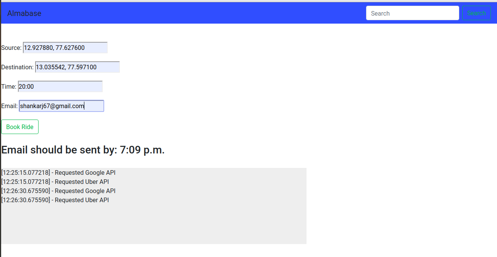

# Bookyourcab API

Creating an API to fetch the time for booking a cab:

- Give you the exact time to book a cab.

## Tech Stack Used

- Django 2.2 and Python 3.7
- Visual Studio Code
- AWS Elastic Beanstalk

## How to use

Go to http://almabase-env.eba-unsiqrpq.us-west-2.elasticbeanstalk.com/findride/ and fill in the data.

Example:

Sorce: 12.927880, 77.627600
Destination: 13.035542, 77.597100
Time: 20:00
Email: shankarj67@gmail.com

Click on book ride and you will get message like this: Email should be sent by: 7:09 p.m.

Screenshot:

# Code Logic

There are one seperate file for all the business logic in bookyourcab/logic.py which has all the business logic for the usecase.

- calculate_google_map_timing() : This will calculate the distance between two place.
- calculate_uber_timing() : This will calculate the estimate time for uber to come to your location.
- send_mail() : This will send you the the mail once the conditions are met. This process can be added to the queue.

# Roadmap

- Add continous integration 
- Add test
- Add Documentation

